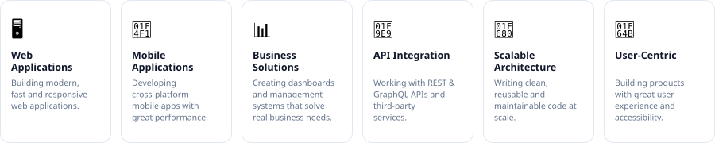
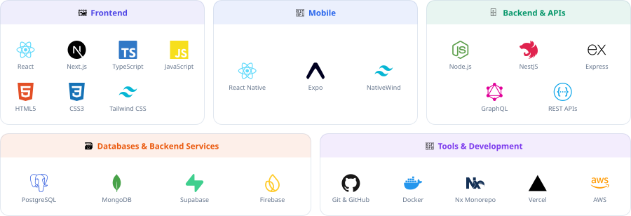
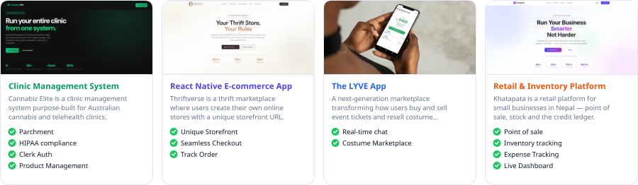
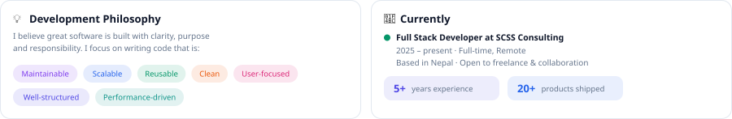
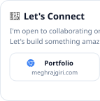
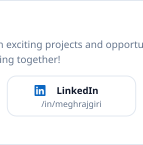
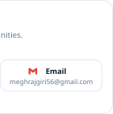

### Hi, I'm

# Meghraj Giri 👋

**Full Stack Developer | Building scalable web &amp; mobile products**

I build modern, fast, and scalable digital products that solve real-world problems.
With experience in web and mobile development, I turn complex ideas and business
requirements into clean, maintainable, and user-friendly applications.

<picture>
  <source media="(prefers-color-scheme: dark)" srcset="assets/pills-dark.svg" />
  
</picture>

###  What I Do

<picture>
  <source media="(prefers-color-scheme: dark)" srcset="assets/what-i-do-dark.svg" />
  
</picture>

###  Tech Stack

<picture>
  <source media="(prefers-color-scheme: dark)" srcset="assets/tech-stack-dark.svg" />
  
</picture>

###  Featured Projects

<picture>
  <source media="(prefers-color-scheme: dark)" srcset="assets/projects-dark.svg" />
  
</picture>

**[More projects on my portfolio →](https://meghrajgiri.com/projects)**

Thanks for visiting my profile! ⭐

